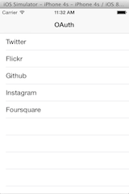

<p align="center">
  
</p>

## OAuthSwift

Swift based OAuth library for iOS and OSX.

### Support OAuth1.0, OAuth2.0

Twitter, Slack, Flickr, Github, Instagram, Foursquare. Fitbit, Withings, Linkedin, Dropbox, Dribbble, Salesforce, BitBucket, GoogleDrive, Smugmug, Intuit, Zaim etc

### Installation

OAuthSwift is packaged as a Swift framework. Currently this is the simplest way to add it to your app:

* Drag OAuthSwift.xcodeproj to your project in the Project Navigator.
* Select your project and then your app target. Open the Build Phases panel.
* Expand the Target Dependencies group, and add OAuthSwift framework.
* import OAuthSwift whenever you want to use OAuthSwift.

### Support Carthage

* Install Carthage (https://github.com/Carthage/Carthage)
* Create Cartfile file
```
github "dongri/OAuthSwift" ~> 0.3.4
```
* Run `carthage update`.
* On your application targets’ “General” settings tab, in the “Embedded Binaries” section, drag and drop OAuthSwift.framework from the Carthage/Build/iOS folder on disk.

### Support CocoaPods

* Podfile
```
platform :ios, '8.0'
use_frameworks!

pod "OAuthSwift", "~> 0.3.4"
```

### Setting URL Schemes


### Examples

```swift
// AppDelegate
func application(application: UIApplication!, openURL url: NSURL!, sourceApplication: String!, annotation: AnyObject!) -> Bool {
  if (url.host == "oauth-callback") {
    if (url.path!.hasPrefix("/twitter")){
      OAuth1Swift.handleOpenURL(url)
    }
    if ( url.path!.hasPrefix("/github" )){
      OAuth2Swift.handleOpenURL(url)
    }
  }
  return true
}

// OAuth1.0
let oauthswift = OAuth1Swift(
    consumerKey:    "********",
    consumerSecret: "********",
    requestTokenUrl: "https://api.twitter.com/oauth/request_token",
    authorizeUrl:    "https://api.twitter.com/oauth/authorize",
    accessTokenUrl:  "https://api.twitter.com/oauth/access_token"
)
oauthswift.authorizeWithCallbackURL( NSURL(string: "oauth-swift://oauth-callback/twitter"), success: {
    credential, response in
    println(credential.oauth_token)
    println(credential.oauth_token_secret)
}, failure: failureHandler)

// OAuth2.0
let oauthswift = OAuth2Swift(
    consumerKey:    "********",
    consumerSecret: "********",
    authorizeUrl:   "https://api.instagram.com/oauth/authorize",
    responseType:   "token"
)
oauthswift.authorizeWithCallbackURL( NSURL(string: "oauth-swift://oauth-callback/instagram"), scope: "likes+comments", state:"INSTAGRAM", success: {
    credential, response in
    println(credential.oauth_token)
}, failure: failureHandler)

```

### OAuth pages

* [Twitter](https://dev.twitter.com/docs/auth/oauth)  
* [Flickr](https://www.flickr.com/services/api/auth.oauth.html)  
* [Github](https://developer.github.com/v3/oauth)  
* [Instagram](http://instagram.com/developer/authentication)  
* [Slack](https://api.slack.com/docs/oauth)
* [Foursquare](https://developer.foursquare.com/overview/auth)  
* [Fitbit](https://wiki.fitbit.com/display/API/OAuth+Authentication+in+the+Fitbit+API)  
* [Withings](http://oauth.withings.com/api)  
* [Linkedin](https://developer.linkedin.com/documents/authentication)  
* [Dropbox](https://www.dropbox.com/developers/core/docs)  
* [Dribbble](http://developer.dribbble.com/v1/oauth/)
* [Salesforce](https://www.salesforce.com/us/developer/docs/api_rest/)
* [BitBucket](https://confluence.atlassian.com/display/BITBUCKET/OAuth+on+Bitbucket)
* [GoogleDrive](https://developers.google.com/drive/v2/reference/)
* [Smugmug](https://smugmug.atlassian.net/wiki/display/API/OAuth)
* [Intuit](https://developer.intuit.com/docs/0100_accounting/0060_authentication_and_authorization/oauth_management_api)
* [Zaim](https://dev.zaim.net/home/api/authorize)

### Images




## License

OAuthSwift is available under the MIT license. See the LICENSE file for more info.
